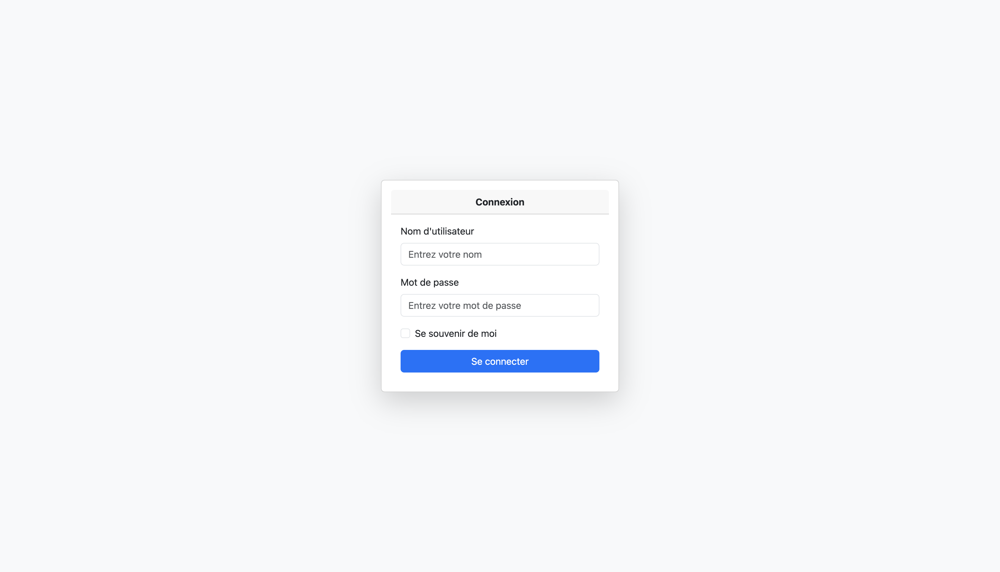
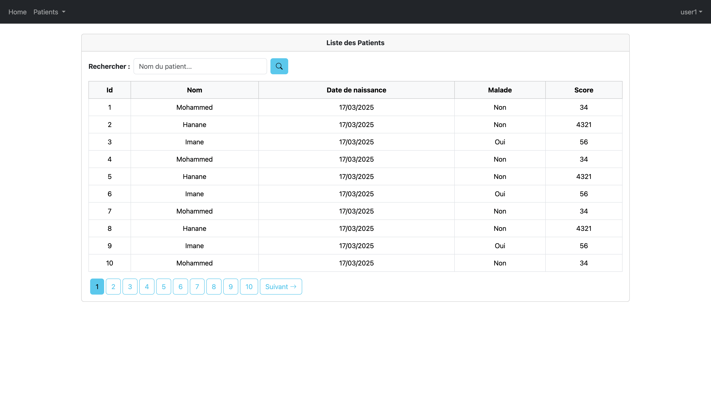
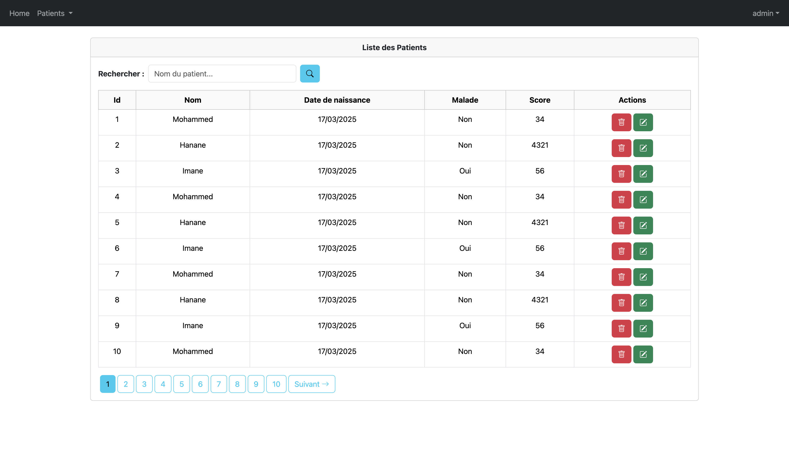
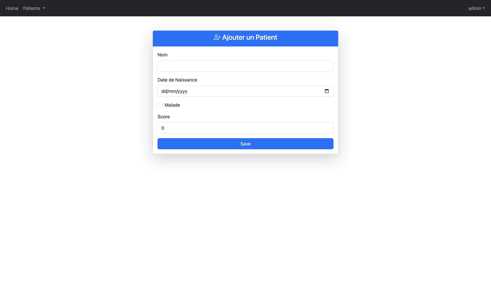
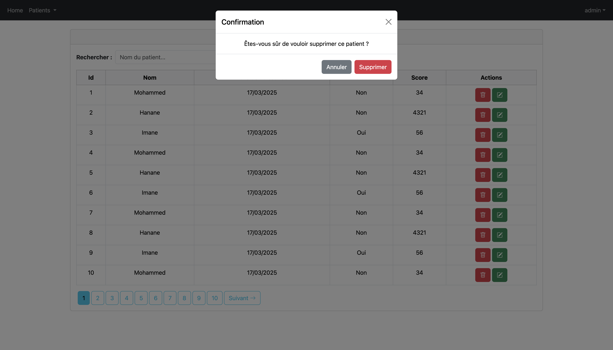
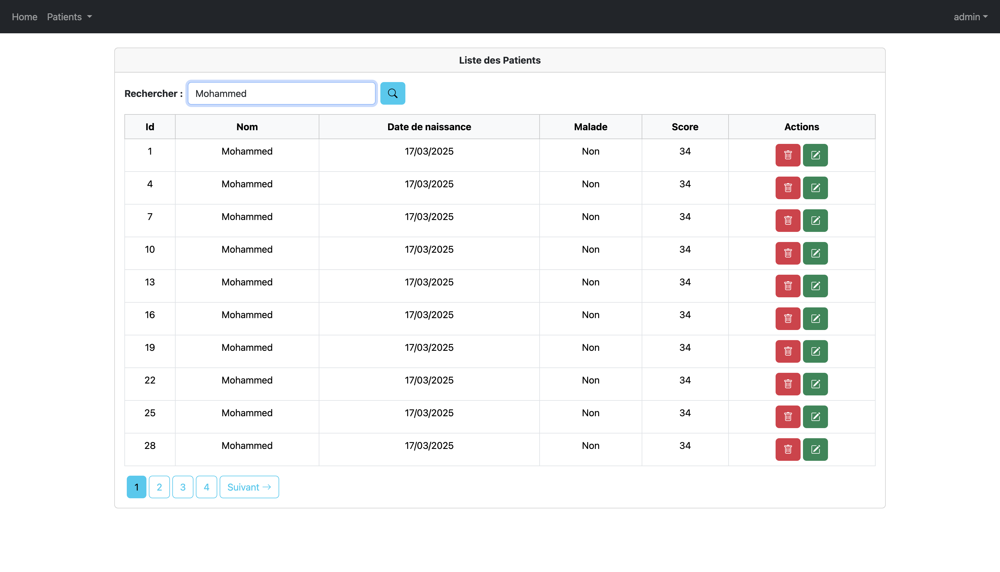

# Gestion des Patients - Application Spring Boot

## Table des matières

- [Description du projet](#-description-du-projet)
- [Fonctionnalités](#-fonctionnalités)
- [Installation et démarrage](#-installation-et-démarrage)
- [Structure du projet](#-structure-du-projet)
- [Captures d'écran](#captures-décran)
- [Liens utiles](#-liens-utiles)


## 📖 Description du projet
Cette application Web JEE permet de gérer des patients en utilisant :
- **Spring Boot 3.4.3** : Base de l'application
- **Spring MVC** : Pour la gestion des contrôleurs et des vues
- **Thymeleaf** : Moteur de templates pour les pages HTML
- **Spring Data JPA** : Interaction avec la base de données
- **H2 (en mémoire) / MySQL** : Base de données (configuration `application.properties`)
- **Spring Security** : Authentification et gestion des rôles (`UserDetailsService`)
- **Bootstrap & Webjars** : UI responsive et composants visuels

## 🚀 Fonctionnalités
1. **Authentification & Autorisation**
    - Login personnalisé (`/login`)
    - Gestion des rôles **USER** et **ADMIN**
    - Pages accessibles selon les rôles (`/user/**`, `/admin/**`)
    - Page de redirection en cas d’accès non autorisé (`/notAuthorized`)

2. **CRUD Patients**
    - Liste des patients avec pagination
    - Recherche par nom
    - Ajout d’un patient
    - Édition d’un patient
    - Suppression d’un patient (confirmation via modal)

3. **Seed de données**
    - Initialisation automatique des patients et des utilisateurs via `CommandLineRunner`

4. **UI/UX améliorations**
    - Templates partagés avec Thymeleaf Layout Dialect
    - Design responsive avec Bootstrap 5
    - Messages de retour après opérations (alertes Bootstrap)
    - Navbar dynamique affichant l’utilisateur connecté et les options disponibles selon le rôle

## 🔧 Installation et démarrage

### Prérequis
- Java 17
- Maven 3+
- MySQL (si utilisation de MySQL)

### Étapes
1. **Cloner le dépôt**
   ```bash
   git clone https://github.com/OsmBHC/hospital-patient-management.git
   cd hospital-patient-management
   ```

2. **Configurer la base de données**
    - Par défaut, l’application utilise MySQL :
      ```properties
      spring.datasource.url=jdbc:mysql://localhost:3307/hopital?createDatabaseIfNotExist=true
      spring.datasource.username=root
      spring.datasource.password=
      ```
    - Pour utiliser H2 en mémoire, décommente :
      ```properties
      spring.datasource.url=jdbc:h2:mem:patients-db
      spring.h2.console.enabled=true
      ```
    - Les scripts `schema.sql` et `data.sql` initialisent les tables `users`, `authorities` et `patients`.

3. **Compiler et lancer**
   ```bash
   mvn clean install
   mvn spring-boot:run
   ```

4. **Accéder à l’application**
    - Login : `http://localhost:8084/login`
    - Liste des patients : `http://localhost:8084/user/index`
    - Consoles :
        - H2 Console (si activé) : `http://localhost:8084/h2-console/`
        - Swagger (si configuré) : `http://localhost:8084/swagger-ui.html`

## 📂 Structure du projet
```
src/
├─ main/
│  ├─ java/ma/enset/hopital/
│  │  ├─ entities/            ← Entités JPA (Patient, AppUser, AppRole)
│  │  ├─ repository/          ← Repositories Spring Data JPA
│  │  ├─ security/            ← Configuration Spring Security
│  │  │   ├─ entities/        ← Entités de sécurité
│  │  │   └─ service/         ← Services de gestion des comptes
│  │  ├─ web/                 ← Contrôleurs MVC et pages Thymeleaf
│  └─ resources/
│     ├─ templates/           ← Templates Thymeleaf
│     ├─ application.properties
│     └─ schema.sql           ← Initialisation de la base
└─ pom.xml
```

## Captures d'écran

Voici quelques interfaces clés de l'application :

1. **Authentification**

   

2. **Liste des patients (User)**

   

3. **Liste des patients (Admin)**

   

4. **Ajout d'un patient**

   

5. **Suppression d'un patient**

   

6. **Recherche**

   


## 📚 Liens utiles
- [Documentation Spring Boot](https://spring.io/projects/spring-boot)
- [Guide Thymeleaf](https://www.thymeleaf.org/documentation.html)
- [Spring Security Reference](https://docs.spring.io/spring-security/reference/)
